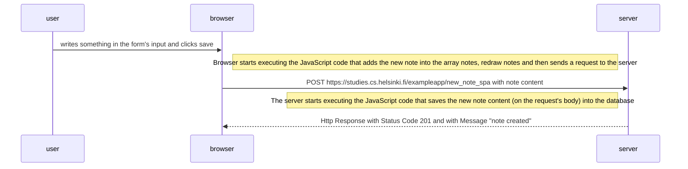

```mermaid
sequenceDiagram
  participant user
  participant browser
  participant server

  user->>browser: writes something in the form's input and clicks save

  Note right of browser: Browser starts executing the JavaScript code that adds the new note into the array notes, redraw notes and then sends a request to the server

  browser->>server: POST https://studies.cs.helsinki.fi/exampleapp/new_note_spa with note content
  Note left of server: The server starts executing the JavaScript code that saves the new note content (on the request's body) into the database
  server-->>browser: Http Response with Status Code 201 and with Message "note created"  
```