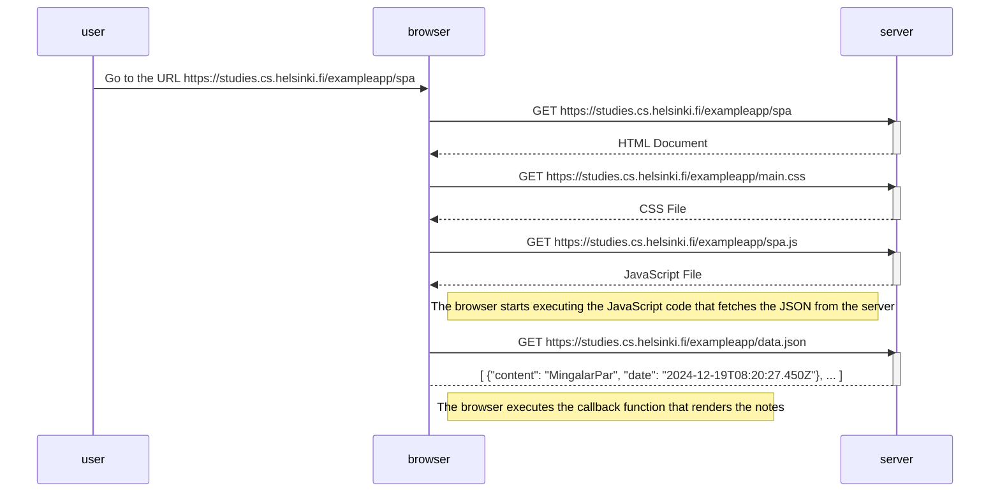

```mermaid
sequenceDiagram
  participant user
  participant browser
  participant server

  user->>browser: Go to the URL https://studies.cs.helsinki.fi/exampleapp/spa
  browser->>server: GET https://studies.cs.helsinki.fi/exampleapp/spa
  activate server
  server-->>browser: HTML Document
  deactivate server

  browser->>server: GET https://studies.cs.helsinki.fi/exampleapp/main.css
  activate server
  server-->>browser: CSS File
  deactivate server

  browser->>server: GET https://studies.cs.helsinki.fi/exampleapp/spa.js
  activate server
  server-->>browser: JavaScript File
  deactivate server

  Note right of browser: The browser starts executing the JavaScript code that fetches the JSON from the server

  browser->>server: GET https://studies.cs.helsinki.fi/exampleapp/data.json
  activate server
  server-->browser: [ {"content": "MingalarPar", "date": "2024-12-19T08:20:27.450Z"}, ... ]
  deactivate server

  Note right of browser: The browser executes the callback function that renders the notes
```